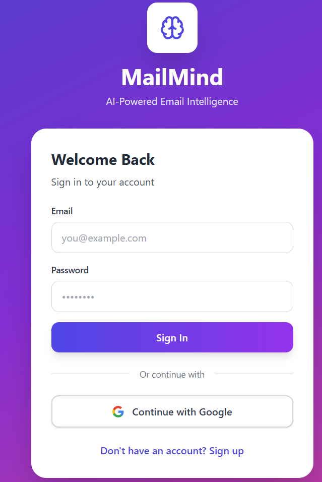
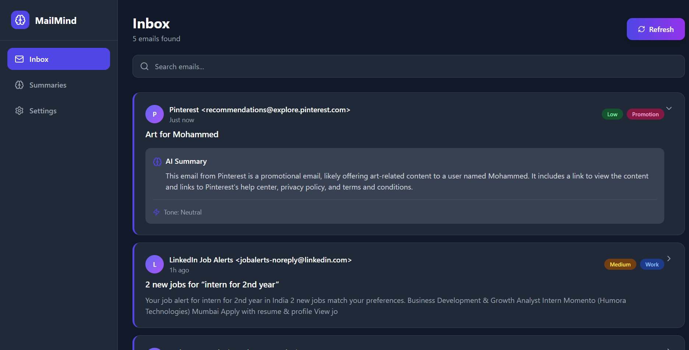
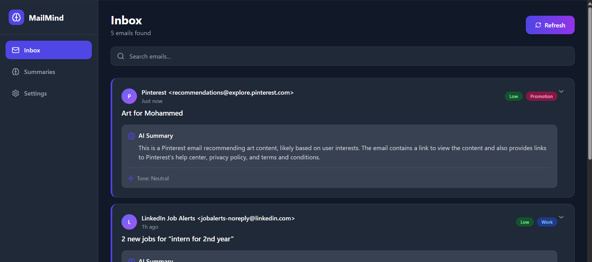
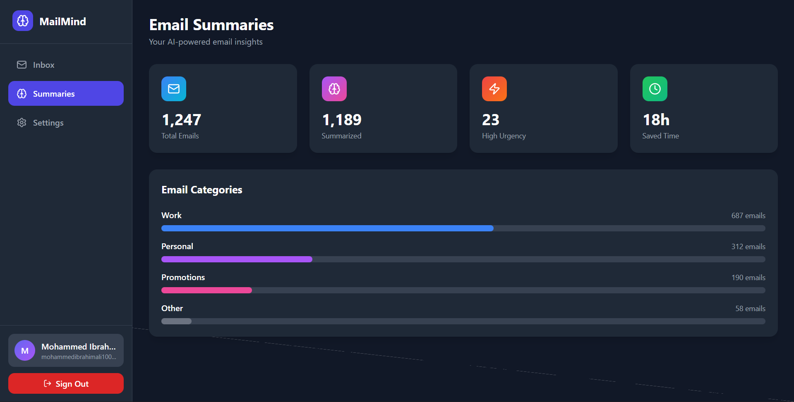

# 🧠 MailMind - AI-Powered Email Summarizer

  

> Transform your inbox into actionable insights with AI-powered email intelligence powered by Google Gemini 2.0 Flash

**MailMind** is a modern, full-stack web application that uses artificial intelligence to automatically summarize, categorize, and analyze your emails. Save time, stay organized, and never miss important messages again.

---

## ✨ Features

### 🔐 **Secure Authentication**
- Firebase Email/Password authentication
- Google Sign-In integration
- Persistent user sessions
- Secure token-based API access

### 📧 **Smart Email Integration**
- Seamless Gmail API connection via OAuth2
- Automatic email fetching from inbox
- Real-time synchronization
- Support for multiple email accounts

### 🤖 **AI-Powered Intelligence**
- **Automatic Summarization** - Get 2-3 sentence summaries of any email
- **Urgency Detection** - Emails classified as High, Medium, or Low priority
- **Tone Analysis** - Identifies Formal, Neutral, or Informal communication style
- **Smart Categorization** - Auto-categorizes as Work, Personal, Promotion, or Other
- **Key Points Extraction** - Highlights important information
- **Action Items Detection** - Identifies tasks and next steps

### 📊 **Analytics Dashboard**
- Email processing statistics
- Category breakdown visualization
- Time-saved calculations
- Urgency distribution charts
- Historical data tracking

### 🎨 **Beautiful User Interface**
- Modern, responsive design
- Dark/Light theme toggle
- Smooth animations and transitions
- Mobile-friendly layout
- Gradient backgrounds and glassmorphism effects
- Intuitive navigation

### ⚡ **Performance & Reliability**
- Fast API responses
- Efficient data caching
- Error handling and graceful fallbacks
- Real-time updates with Firestore
- Automatic model fallback (Gemini 2.0 Flash → 1.5 Flash → Pro)

---

## 🏗️ Architecture

```
┌─────────────────────────────────────────────────────────────┐
│                         Frontend                            │
│  React 18 + Tailwind CSS + Firebase SDK + Axios            │
│  ┌─────────────┐  ┌──────────────┐  ┌──────────────┐      │
│  │   Auth UI   │  │   Dashboard  │  │   Settings   │      │
│  └─────────────┘  └──────────────┘  └──────────────┘      │
└────────────────────────┬────────────────────────────────────┘
                         │ HTTPS/REST API
┌────────────────────────▼────────────────────────────────────┐
│                      Backend API                            │
│           FastAPI + Python 3.11 + Firebase Admin            │
│  ┌──────────────┐  ┌──────────────┐  ┌──────────────┐      │
│  │ Auth Verify  │  │ Email Agent  │  │Email Fetcher │      │
│  └──────────────┘  └──────────────┘  └──────────────┘      │
└─────────┬──────────────┬──────────────────┬─────────────────┘
          │              │                  │
┌─────────▼─────┐ ┌──────▼────────┐ ┌──────▼─────────┐
│   Firebase    │ │  Gemini AI    │ │   Gmail API    │
│   Firestore   │ │  2.0 Flash    │ │    OAuth2      │
│      +        │ │               │ │                │
│     Auth      │ │               │ │                │
└───────────────┘ └───────────────┘ └────────────────┘
```

---

## 🚀 Quick Start

### Prerequisites

Before you begin, ensure you have:

- **Node.js** (v16 or higher) - [Download](https://nodejs.org/)
- **Python** (v3.9 or higher) - [Download](https://python.org/)
- **Git** - [Download](https://git-scm.com/)
- A **Google Account** for Firebase, Gmail API, and Gemini API

### Installation

#### 1. Clone the Repository

```bash
git clone https://github.com/MohdIbrahimAli/mailmind.git
cd mailmind
```

#### 2. Backend Setup

```bash
cd backend

# Create virtual environment
python -m venv venv

# Activate virtual environment
# Windows
venv\Scripts\activate
# Mac/Linux
source venv/bin/activate

# Install dependencies
pip install -r requirements.txt

# Create .env file
cp .env.example .env
# Edit .env and add your API keys
```

**Required Environment Variables (`backend/.env`):**

```env
FIREBASE_SERVICE_ACCOUNT_KEY_PATH=./firebase-key.json
GOOGLE_API_KEY=your_gemini_api_key_here
HOST=0.0.0.0
PORT=8000
DEBUG=True
```

#### 3. Frontend Setup

```bash
cd ../frontend

# Install dependencies
npm install

# Create .env file
cp .env.example .env
# Edit .env and add your Firebase config
```

**Required Environment Variables (`frontend/.env`):**

```env
VITE_FIREBASE_API_KEY=your_firebase_api_key
VITE_FIREBASE_AUTH_DOMAIN=your-project.firebaseapp.com
VITE_FIREBASE_PROJECT_ID=your-project-id
VITE_FIREBASE_STORAGE_BUCKET=your-project.appspot.com
VITE_FIREBASE_MESSAGING_SENDER_ID=123456789
VITE_FIREBASE_APP_ID=1:123:web:abc
VITE_API_BASE_URL=http://localhost:8000
```

#### 4. Configure Services

##### Firebase Setup

1. Go to [Firebase Console](https://console.firebase.google.com/)
2. Create a new project
3. Enable **Authentication** (Email/Password + Google)
4. Create **Firestore Database**
5. Download service account key → Save as `backend/firebase-key.json`
6. Copy web app config → Add to `frontend/.env`

##### Gmail API Setup

1. Go to [Google Cloud Console](https://console.cloud.google.com/)
2. Enable **Gmail API**
3. Create **OAuth 2.0 Client ID** (Desktop app)
4. Download credentials → Save as `backend/credentials.json`
5. Add your email as test user in OAuth consent screen

##### Gemini API Setup

1. Visit [Google AI Studio](https://makersuite.google.com/app/apikey)
2. Create API key
3. Add to `backend/.env` as `GOOGLE_API_KEY`

#### 5. Run the Application

**Terminal 1 - Backend:**
```bash
cd backend
python main.py
```

Expected output:
```
✅ Connected to Google Gemini AI (Model: gemini-2.0-flash-lite)
🚀 Starting MailMind API Server...
📧 Email Agent Status: ✅ Active
INFO:     Uvicorn running on http://0.0.0.0:8000
```

**Terminal 2 - Frontend:**
```bash
cd frontend
npm run dev
```

Expected output:
```
VITE v5.0.8  ready in 500 ms
➜  Local:   http://localhost:5173/
```

#### 6. First-Time Gmail Authorization

When you first click "Refresh" in the Inbox:

1. Check backend terminal
2. A browser window will open for Gmail OAuth
3. Sign in and grant permissions
4. Token will be saved as `backend/token.pickle`

#### 7. Access the Application

Open your browser and navigate to:
```
http://localhost:5173
```

---

## 📁 Project Structure

```
mailmind/
├── frontend/                   # React application
│   ├── src/
│   │   ├── components/        # (Future: Reusable components)
│   │   ├── contexts/          # React contexts
│   │   │   ├── AuthContext.jsx
│   │   │   └── ThemeContext.jsx
│   │   ├── services/          # API integration
│   │   │   └── api.js
│   │   ├── App.jsx           # Main application component
│   │   ├── firebase.js       # Firebase configuration
│   │   ├── main.jsx          # Entry point
│   │   └── index.css         # Global styles
│   ├── public/
│   ├── .env                  # Environment variables
│   ├── package.json
│   ├── tailwind.config.js
│   └── vite.config.js
│
├── backend/                   # FastAPI application
│   ├── main.py               # Main API server
│   ├── email_agent.py        # Gemini AI integration
│   ├── email_fetcher.py      # Gmail API integration
│   ├── requirements.txt      # Python dependencies
│   ├── .env                  # Environment variables
│   ├── firebase-key.json     # Firebase service account
│   ├── credentials.json      # Gmail OAuth credentials
│   └── token.pickle          # Gmail OAuth token (auto-generated)
│
├── docs/                     # Documentation
├── .gitignore
├── README.md
└── LICENSE
```

---

## 🛠️ Tech Stack

### Frontend
| Technology | Version | Purpose |
|------------|---------|---------|
| React | 18.2.0 | UI framework |
| Tailwind CSS | 3.4.1 | Styling |
| Vite | 5.0.8 | Build tool |
| Firebase | 10.7.2 | Authentication & Database |
| Axios | 1.6.5 | HTTP client |
| Lucide React | 0.309.0 | Icons |

### Backend
| Technology | Version | Purpose |
|------------|---------|---------|
| Python | 3.11+ | Programming language |
| FastAPI | 0.109.0 | Web framework |
| Uvicorn | 0.27.0 | ASGI server |
| Firebase Admin | 6.4.0 | Firebase SDK |
| Google API Client | 2.116.0 | Gmail API |
| Requests | 2.31.0 | HTTP library for Gemini |
| BeautifulSoup4 | 4.12.3 | HTML parsing |

### AI & Cloud Services
- **Google Gemini 2.0 Flash Lite** - Email summarization and analysis
- **Firebase Auth** - User authentication
- **Firestore** - NoSQL database
- **Gmail API** - Email access

---

## 📖 API Documentation

### Authentication

All protected endpoints require Firebase ID token in header:
```
Authorization: Bearer <firebase_id_token>
```

### Endpoints

#### Health Check
```http
GET /
```
Returns API status and available services.

#### Summarize Email
```http
POST /api/summarize
Content-Type: application/json
Authorization: Bearer <token>

{
  "email_body": "Email content...",
  "email_subject": "Email subject",
  "email_sender": "sender@example.com",
  "summary_length": "Medium"
}
```

#### Fetch Emails from Gmail
```http
POST /api/gmail/fetch
Content-Type: application/json
Authorization: Bearer <token>

{
  "user_id": "firebase_user_id",
  "max_results": 5
}
```

#### Get User Summaries
```http
GET /api/summaries/{user_id}?limit=50
Authorization: Bearer <token>
```

#### Get Analytics
```http
GET /api/analytics/{user_id}
Authorization: Bearer <token>
```

#### Generate Reply
```http
POST /api/gmail/reply
Content-Type: application/json
Authorization: Bearer <token>

{
  "email_id": "msg_id",
  "email_subject": "Re: Subject",
  "email_body": "Original email body",
  "email_sender": "sender@example.com",
  "tone": "professional"
}
```

#### Update Preferences
```http
POST /api/user/preferences
Content-Type: application/json
Authorization: Bearer <token>

{
  "summary_length": "Medium",
  "theme": "dark"
}
```

#### Clear Summaries
```http
DELETE /api/summaries/{user_id}
Authorization: Bearer <token>
```

**Interactive API Documentation:** http://localhost:8000/docs

---

## 🎨 Screenshots

### Login Page


*Beautiful gradient authentication with Email/Password and Google Sign-In*

### Dashboard - Inbox


*Clean, modern inbox with AI-generated summaries and smart tags*

### Email Summary View


*Detailed view with key points, action items, and AI analysis*

### Analytics


*Visual insights into email patterns and time saved*

### Settings


*Customizable preferences with dark mode support*

---

## 🔒 Security

### Authentication & Authorization
- ✅ Firebase Authentication with secure token verification
- ✅ JWT-based API authentication
- ✅ OAuth 2.0 for Gmail access
- ✅ User-specific data isolation in Firestore
- ✅ CORS protection
- ✅ Input validation and sanitization

### Data Protection
- ✅ Email data stored securely in Firestore
- ✅ Encrypted credentials and tokens
- ✅ Environment-based secrets management
- ✅ No sensitive data in client-side code
- ✅ Automatic token refresh

### Best Practices
- ✅ No API keys in version control
- ✅ Rate limiting ready
- ✅ Error handling without data leakage
- ✅ Secure Firebase rules
- ✅ HTTPS enforcement in production

---

## 🚀 Deployment

### Frontend Deployment (Vercel)

1. **Push to GitHub**
```bash
git add .
git commit -m "Ready for deployment"
git push origin main
```

2. **Deploy to Vercel**
```bash
npm i -g vercel
cd frontend
vercel login
vercel --prod
```

3. **Set Environment Variables** in Vercel Dashboard
- Add all `VITE_*` variables
- Update `VITE_API_BASE_URL` to production backend URL

### Backend Deployment (Railway)

1. **Install Railway CLI**
```bash
npm i -g @railway/cli
```

2. **Deploy**
```bash
cd backend
railway login
railway init
railway up
```

3. **Set Environment Variables** in Railway Dashboard
- Add all variables from `.env`
- Upload `firebase-key.json` and `credentials.json` as files

### Alternative: Docker Deployment

```bash
# Build and run with Docker Compose
docker-compose up -d
```

### Post-Deployment
- Update CORS origins in `main.py` to production domains
- Configure custom domain
- Enable Firebase App Check
- Set up monitoring (e.g., Sentry)
- Configure CDN for frontend assets

---

## 🧪 Testing

### Backend Tests
```bash
cd backend

# Test Gemini AI connection
python -c "from email_agent import EmailAgent; agent = EmailAgent(); print('✅ AI Working')"

# Test Gmail API connection
python -c "from email_fetcher import EmailFetcher; f = EmailFetcher(); print('✅ Gmail Working')"

# Test API endpoints
curl http://localhost:8000/
curl http://localhost:8000/api/test-cors
```

### Frontend Tests
```bash
cd frontend

# Run development server
npm run dev

# Build for production
npm run build

# Preview production build
npm run preview
```

### End-to-End Testing
1. Sign up with new account
2. Sign in with Google
3. Connect Gmail (complete OAuth)
4. Fetch emails
5. Verify summaries appear
6. Check analytics
7. Toggle dark mode
8. Update preferences
9. Sign out and back in

---

## 🐛 Troubleshooting

### Common Issues

#### "Firebase authentication failed"
- **Cause:** Invalid Firebase credentials
- **Solution:** Verify `firebase-key.json` is correct and path in `.env` matches

#### "Gmail not authorized"
- **Cause:** OAuth not completed
- **Solution:** Delete `token.pickle` and restart backend to trigger OAuth flow

#### "CORS policy error"
- **Cause:** Backend not running or CORS misconfigured
- **Solution:** Ensure backend is running and frontend URL is in CORS allowed origins

#### "Timeout of 30000ms exceeded"
- **Cause:** Email processing taking too long
- **Solution:** Reduce `max_results` in fetch request (try 3 emails instead of 10)

#### "Gemini API error"
- **Cause:** Invalid API key or rate limit
- **Solution:** Verify API key at [Google AI Studio](https://makersuite.google.com/app/apikey)

#### "'Sentinel' object is not iterable"
- **Cause:** Trying to serialize Firestore timestamp
- **Solution:** Already fixed in latest version - make sure you're using updated `main.py`

### Debug Mode

Enable detailed logging:

**Backend:**
```python
# In main.py
import logging
logging.basicConfig(level=logging.DEBUG)
```

**Frontend:**
```javascript
// In browser console
localStorage.debug = '*'
```

### Getting Help

1. Check [Issues](https://github.com/MohdIbrahimAli/mailmind/issues) for similar problems
2. Review backend terminal logs
3. Check browser console for errors
4. Verify all environment variables are set
5. Test individual components separately

---

## 🤝 Contributing

Contributions are welcome! Please follow these steps:

1. **Fork the repository**
2. **Create a feature branch**
   ```bash
   git checkout -b feature/AmazingFeature
   ```
3. **Commit your changes**
   ```bash
   git commit -m 'Add some AmazingFeature'
   ```
4. **Push to the branch**
   ```bash
   git push origin feature/AmazingFeature
   ```
5. **Open a Pull Request**

### Development Guidelines
- Follow existing code style
- Add comments for complex logic
- Test your changes thoroughly
- Update documentation as needed
- Keep commits atomic and well-described

---

## 📋 Roadmap

### Version 2.0 (Planned)
- [ ] Multi-language support
- [ ] Email scheduling and reminders
- [ ] Advanced filtering and search
- [ ] Email templates library
- [ ] Calendar integration
- [ ] Slack/Teams notifications
- [ ] Mobile app (React Native)
- [ ] Voice commands integration
- [ ] Collaborative features
- [ ] Email threading
- [ ] Attachment handling
- [ ] Custom AI training

### Version 1.1 (In Progress)
- [x] Real Gmail integration
- [x] AI-powered summaries
- [x] Analytics dashboard
- [ ] Reply suggestions
- [ ] Batch processing
- [ ] Export functionality
- [ ] Email rules automation

---

## 📄 License

This project is licensed under the MIT License - see the [LICENSE](LICENSE) file for details.

```
MIT License

Copyright (c) 2025 MailMind

Permission is hereby granted, free of charge, to any person obtaining a copy
of this software and associated documentation files (the "Software"), to deal
in the Software without restriction, including without limitation the rights
to use, copy, modify, merge, publish, distribute, sublicense, and/or sell
copies of the Software, and to permit persons to whom the Software is
furnished to do so, subject to the following conditions:

The above copyright notice and this permission notice shall be included in all
copies or substantial portions of the Software.

THE SOFTWARE IS PROVIDED "AS IS", WITHOUT WARRANTY OF ANY KIND, EXPRESS OR
IMPLIED, INCLUDING BUT NOT LIMITED TO THE WARRANTIES OF MERCHANTABILITY,
FITNESS FOR A PARTICULAR PURPOSE AND NONINFRINGEMENT. IN NO EVENT SHALL THE
AUTHORS OR COPYRIGHT HOLDERS BE LIABLE FOR ANY CLAIM, DAMAGES OR OTHER
LIABILITY, WHETHER IN AN ACTION OF CONTRACT, TORT OR OTHERWISE, ARISING FROM,
OUT OF OR IN CONNECTION WITH THE SOFTWARE OR THE USE OR OTHER DEALINGS IN THE
SOFTWARE.
```

---

## 🙏 Acknowledgments

### Technologies
- **Google Gemini AI** - For powerful language understanding
- **Firebase** - For authentication and database services
- **Gmail API** - For email integration
- **React** - For the amazing UI framework
- **FastAPI** - For the lightning-fast backend
- **Tailwind CSS** - For beautiful, responsive styling

### Inspiration
- Modern email clients (Superhuman, Hey)
- AI-powered productivity tools
- Open-source community

### Contributors
Special thanks to all contributors who help make MailMind better!

---

## 📞 Support & Contact

### Documentation
- **Setup Guide:** [docs/SETUP.md](docs/SETUP.md)
- **API Reference:** http://localhost:8000/docs
- **Troubleshooting:** [docs/TROUBLESHOOTING.md](docs/TROUBLESHOOTING.md)

### Community
- **GitHub Issues:** [Report bugs or request features](https://github.com/MohdIbrahimAli/mailmind/issues)
- **Discussions:** [Join the conversation](https://github.com/MohdIbrahimAli/mailmind/discussions)
- **Email:** support@mailmind.app

### Stay Updated
- ⭐ Star this repo to show support
- 👀 Watch for updates
- 🍴 Fork to create your own version

---

## 📊 Project Status


**Status:** ✅ Active Development  
**Latest Version:** 1.0.0  
**Last Updated:** November 2025

---

<div align="center">

**Built with ❤️ by the MailMind Team**

[Website](https://mailmind.app) • [Documentation](https://docs.mailmind.app) • [Demo](https://demo.mailmind.app)

⭐ **Star us on GitHub — it helps!**

</div>

---

## 🎯 Quick Commands Cheat Sheet

```bash
# Backend
cd backend
source venv/bin/activate          # Activate virtual env (Mac/Linux)
venv\Scripts\activate              # Activate virtual env (Windows)
python main.py                     # Start server
pip install -r requirements.txt   # Install dependencies

# Frontend
cd frontend
npm install                        # Install dependencies
npm run dev                        # Start development server
npm run build                      # Build for production
npm run preview                    # Preview production build

# Testing
curl http://localhost:8000/                    # Test backend health
curl http://localhost:8000/api/test-cors      # Test CORS

# Deployment
vercel --prod                      # Deploy frontend to Vercel
railway up                         # Deploy backend to Railway
docker-compose up -d              # Run with Docker
```

---

**Happy Email Management! 🚀📧**